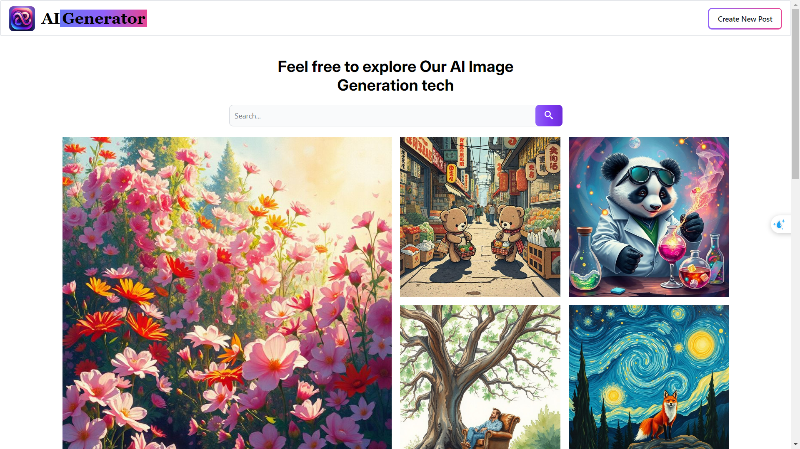
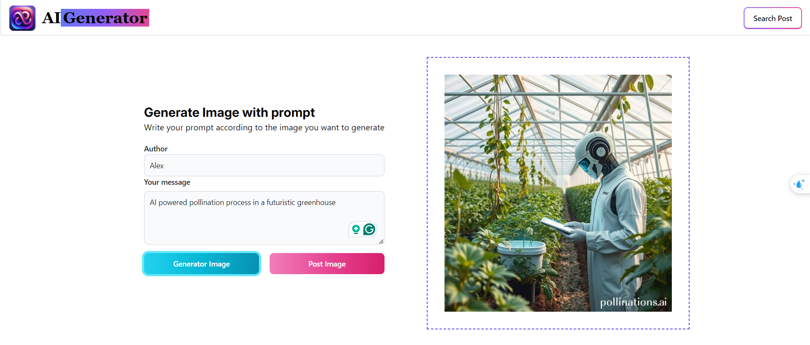

# AI Image Generation App

## Project description :
A full stack mern AI image generation app that uses dall.e api in order to allow you to generate new images from text, you can also share a post with the community that contains the generated image and its description. In addition you can search for a post or download it.

## Image
### Home Page

### Create new Post

## Features added
- Generate new images from text
- Search functionality.
- Download generated images to user's device.
- Share functionality to share the AI generated images with the community on the community section.

## Technologies Used
### Frontend
- **React**: A JavaScript library for building user interfaces
- **Redux**: State management library
- **Tailwindcss**: Styling
### Backend
- **Node.js**: JavaScript runtime built on Chrome's V8 JavaScript engine
- **Express.js**: Web framework for Node.js
### Database
- **MongoDB**: NoSQL database
- **Mongoose**: MongoDB object modeling tool
- **Cloudinary**: Image repository
### API
- **Pollinations Ai**:
